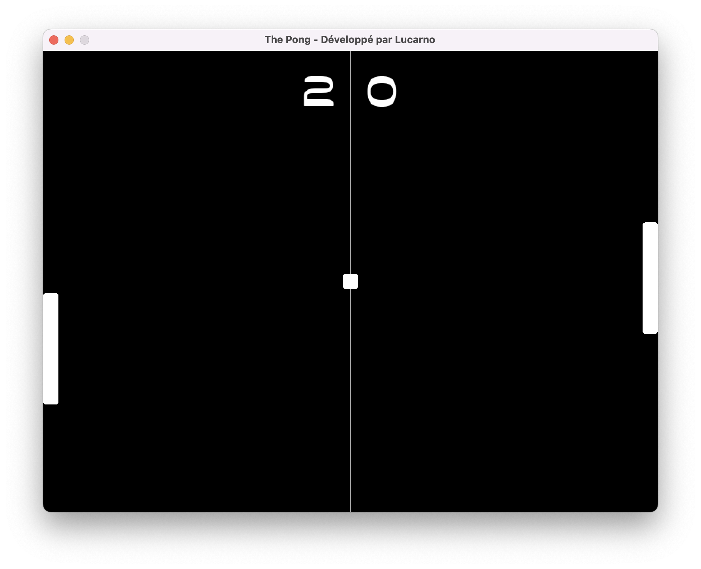
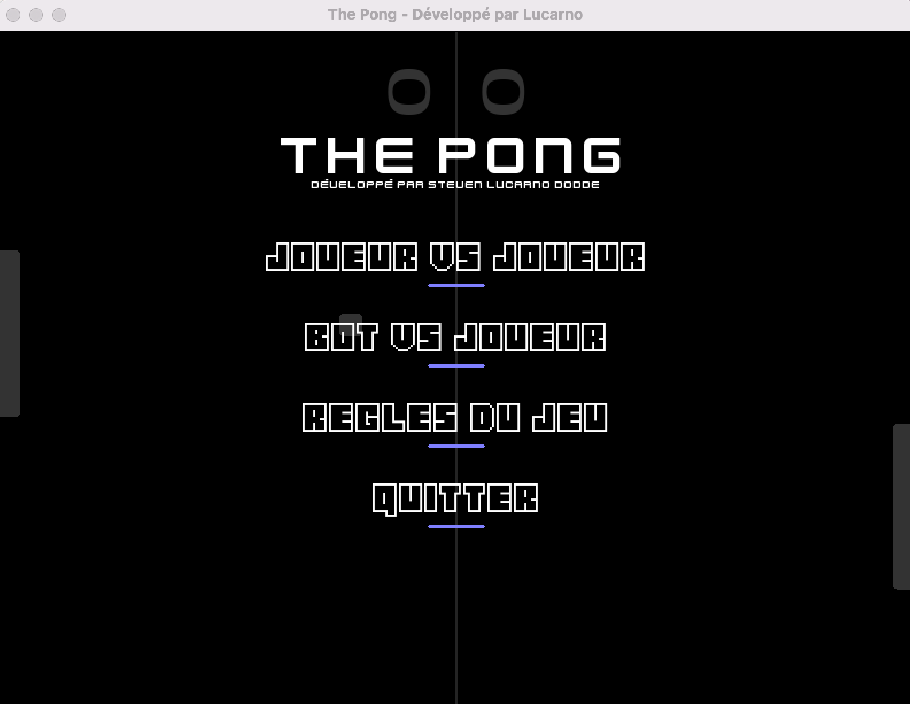
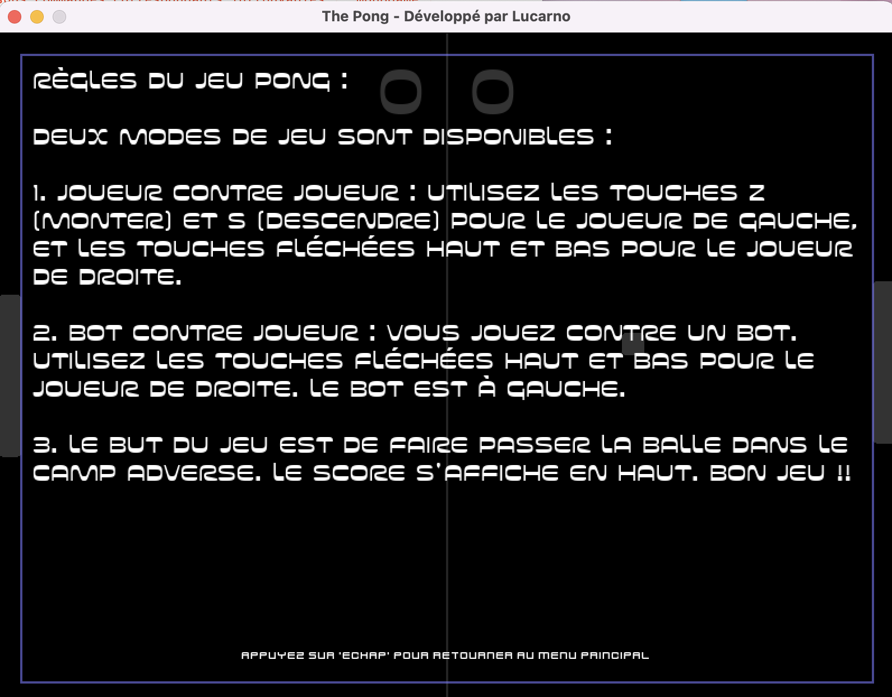
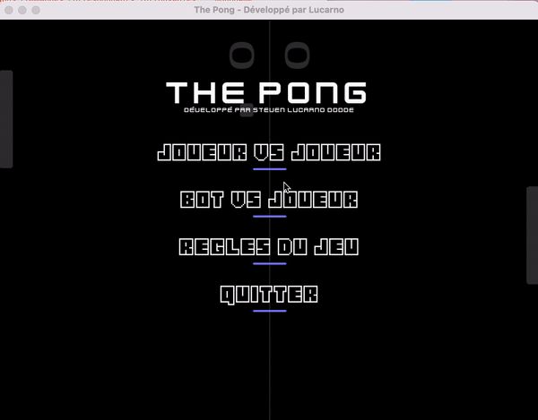

# pong-lua
## Présentation du projet Pong

Pong est un jeu vidéo classique de tennis de table en deux dimensions. Le joueur contrôle une raquette dans un jeu de tennis de table simulé en vue de dessus. Les joueurs utilisent la raquette pour frapper une balle de manière à ce qu'elle rebondisse sur le côté opposé de l'écran. Le but est de marquer des points en forçant l'adversaire à manquer la balle.

Voici quelques captures d'écran du jeu :

